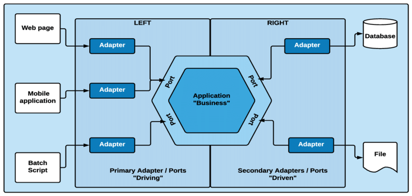

<h1 align="center">Hexagonal Architecture API</h1>

<p align="center">
  <a></a>
  <a></a>
  <a></a>
  <a></a>
  <a></a>
</p>

<p align="center">Uma API construída com Arquitetura Hexagonal utilizando o módulo HTTP nativo do Node.js</p>

## 📜 Sumário

- [📋 Sobre o Projeto](#-sobre-o-projeto)
- [📦 Pré-requisitos](#-pré-requisitos)
- [🔧 Configurando o Projeto](#-configurando-o-projeto)
- [🧠 Modelagem Lógica](#-modelagem-lógica)
- [📊 Modelagem Física](#-modelagem-física)
  - [📄 Detalhes sobre as Tabelas](#-detalhes-sobre-as-tabelas)
  - [💡 Considerações](#-considerações)
- [📍 Endpoints da Aplicação](#-endpoints-da-aplicação)
- [🏗️ Arquitetura Hexagonal](#️-arquitetura-hexagonal)
  - [🧩 Componentes da Arquitetura Hexagonal](#-componentes-da-arquitetura-hexagonal)
  - [🌟 Vantagens da Arquitetura Hexagonal](#-vantagens-da-arquitetura-hexagonal)
  - [📂 Organização de Diretórios](#-organização-de-diretórios)
- [🧪 Testes](#-testes)
  - [⚡ Testes Unitários](#-testes-unitários)
  - [⚗️ Testes de Integração](#️-testes-de-integração)
  - [♾️ Testes de Ponta a Ponta (E2E)](#️-testes-de-ponta-a-ponta-e2e)
- [👤 Autor](#-autor)
- [⚖️ Licença](#️-licença)

## 📋 Sobre o Projeto

Este projeto visa demonstrar a aplicação prática dos conceitos e princípios da Arquitetura Hexagonal (Port and Adapters), dando destaque a uma base de código flexível, fácil de testar e simples de manter. Para alcançar esse objetivo foi desenvolvida uma API com TypeScript com o menor número de dependências possível, tendo em mente um código atemporal. Além disso, o projeto conta com uma biblioteca interna enxuta que abstrai a lógica do módulo HTTP nativo do NodeJS, sendo ela inspirada nos frameworks [Express](https://github.com/expressjs/express) e [Fastify](https://github.com/fastify/fastify).

> [!WARNING]
>
> A biblioteca desenvolvida neste projeto não é robusta o suficiente para ambientes de produção. Ela foi criada com fins educativos. Para aplicações em produção, recomenda-se o uso de soluções mais maduras.

## 📦 Pré-requisitos

Antes de começar, verifique se você possui as seguintes ferramentas:

- Runtime **[Node.js](https://nodejs.org/)** versão 20.9.0 ou acima
- Gerenciador de pacotes **[pnpm](https://pnpm.io/installation#using-npm)**
- _Um editor de código de sua preferência (recomendado: VSCode)_

## 🔧 Configurando o Projeto

Siga os passos abaixo para configurar e executar o projeto:

1. **Clone o repositório:**

   ```bash
   git clone https://github.com/cybermumuca/hexagonal-architecture-api.git
   ```

2. **Instale as dependências:**

   ```bash
   cd hexagonal-architecture-api
   pnpm install
   ```

3. **Configure as variáveis de ambiente:**

   O arquivo `.env` contém as variáveis de ambiente do projeto. Para configurá-las, você pode copiar o arquivo `.env.example` que contém as variáveis que o projeto necessita para funcionar e uma sugestão para os valores que ela deve conter:

   - Ao clonar o repositorio o arquivo `.env` não irá existir, copie o conteúdo do arquivo `.env.example` para um novo arquivo `.env`:

     ```bash
     cp .env.example .env
     ```

   - A variável `DATABASE` define o arquivo que o SQLite usará para armazenar os dados. Você pode especificar um caminho para um arquivo existente ou não no sistema ou então usar `:memory:` para armazenar os dados na memória enquanto o programa executa.

> [!IMPORTANT]
>
> O arquivo `.env` **nunca** deve ser versionado, pois ele contém segredos e informações sensíveis, como credenciais de acesso a bancos de dados, chaves de API e outras configurações que podem comprometer a segurança da aplicação e dos dados. Cada desenvolvedor deve configurar seu próprio arquivo `.env` localmente com suas respectivas variáveis de ambiente.
>
> No caso deste projeto, expor isso não implicará em problemas de segurança, pois ele é completamente educacional e não contém informações sensíveis. No entanto, o arquivo `.env` ainda não deve ser commitado para evitar conflitos com os ambientes de outros desenvolvedores.
>
> Para garantir que o arquivo `.env` não seja adicionado ao repositório, verifique se ele está listado no arquivo `.gitignore`.

4. **Executando o projeto:**

   Ao chegar nesse passo você já tem tudo que precisa para executar a aplicação em desenvolvimento ou simplesmente gerar o build e dar start.

   - Para gerar o build e executar

     ```bash
     pnpm build
     pnpm start
     ```

   - Para executar em modo de desenvolvimento

     ```bash
     pnpm dev
     ```

## 🧠 Modelagem Lógica

A modelagem lógica é a representação abstrata dos dados de um sistema, sem se preocupar com detalhes específicos do banco de dados, ela define as entidades, os atributos dessas entidades e os relacionamentos entre elas. O modelo está descrito dessa forma:

- **User**: Representa um usuário do sistema.

  - **Atributos**: id, username, password.
  - **Relacionamentos**: Um User possui vários Posts.

- **Post**: Representa uma postagem feita por um usuário.

  - **Atributos**: id, content, authorId.
  - **Relacionamentos**: Um Post pertence a um User e pode ter várias Categorias.

- **Category**: Representa uma categoria que pode ser associada a um Post.

  - **Atributos**: id, name.
  - **Relacionamentos**: Uma Category pode estar associada a vários Posts.

- **posts_categories**: Tabela de associação entre Post e Category para representar o relacionamento muitos-para-muitos.
  - **Atributos**: category_id, post_id

**Relacionamentos**:

- (1-M) Users - Posts
- (N-M) Posts - Categories

> [!TIP]
> Se preferir algo mais visual, acesse esse [diagrama](./diagram.png).

## 📊 Modelagem Física

A modelagem física traduz a modelagem lógica para uma implementação específica de um banco de dados. Ela envolve a definição de tipos de dados, índices, restrições e outras particularidades do banco de dados. A modelagem física para nosso projeto, usando SQLite, é implementada com o seguinte SQL:

```sql
CREATE TABLE IF NOT EXISTS users(
  id TEXT PRIMARY KEY NOT NULL,
  username TEXT NOT NULL UNIQUE,
  password TEXT NOT NULL
);

CREATE TABLE IF NOT EXISTS categories(
  id TEXT PRIMARY KEY NOT NULL,
  name TEXT NOT NULL UNIQUE
);

CREATE TABLE IF NOT EXISTS posts(
  id TEXT PRIMARY KEY NOT NULL,
  content TEXT DEFAULT "",
  authorId TEXT NOT NULL,
  FOREIGN KEY (authorId) REFERENCES users (id) ON UPDATE CASCADE ON DELETE CASCADE
);

CREATE TABLE IF NOT EXISTS posts_categories(
  category_id TEXT NOT NULL,
  post_id TEXT NOT NULL,
  FOREIGN KEY(category_id) REFERENCES categories (id) ON UPDATE CASCADE ON DELETE CASCADE,
  FOREIGN KEY(post_id) REFERENCES posts (id) ON UPDATE CASCADE ON DELETE CASCADE,
  PRIMARY KEY (category_id, post_id)
);
```

> [!TIP]
> Também é possível visualizar o DDL nesse [arquivo](./db.sql)

### 📄 Detalhes sobre as Tabelas

- Tabela **users**: Contém informações sobre os usuários.

  - **id**: Identificador único do usuário.
  - **username**: Nome de usuário único.
  - **password**: Senha do usuário.

- Tabela **categories**: Contém informações sobre as categorias.

  - **id**: Identificador único da categoria.
  - **name**: Nome da categoria único.

- Tabela **posts**: Contém informações sobre os posts.

  - **id**: Identificador único do post.
  - **content**: Conteúdo do post.
  - **authorId**: Identificador do usuário que criou o post, referenciando a tabela users.

- Tabela **posts_categories**: Tabela de junção(pivô) usada para representar o relacionamento muitos-para-muitos entre posts e categorias.
  - **category_id**: Identificador da categoria, referenciando a tabela categories.
  - **post_id**: Identificador do post, referenciando a tabela posts.

> [!NOTE]
> Todos os campos `id` são UUIDv4.

### 💡 Considerações

- **Integridade Referencial**: As chaves estrangeiras garantem que os relacionamentos entre as tabelas sejam mantidos. Se um usuário ou categoria for deletado, os posts associados serão atualizados ou deletados em conformidade com as regras de ON UPDATE CASCADE e ON DELETE CASCADE.
- **Índices**: As chaves primárias e únicas criam índices automaticamente, melhorando a performance das consultas.
- **Normalização**: A estrutura de tabelas segue as regras de normalização, minimizando a redundância e garantindo a consistência dos dados.

Ao seguir essas práticas, garantimos que o banco de dados funcione corretamente e represente parcialmente a regra de négocio.

## 📍 Endpoints da Aplicação

| Método HTTP | Endpoint               | Descrição                                         |
| ----------- | ---------------------- | ------------------------------------------------- |
| POST        | /auth/register         | Registra o usuário.                               |
| POST        | /auth/signin           | Autentica o usuário.                              |
| GET         | /auth/me               | Retorna dados do usuário autenticado.             |
| POST        | /categories            | Cria uma nova categoria.                          |
| GET         | /categories            | Faz paginação nas categorias.                     |
| GET         | /categories/{id}       | Obtém uma categoria específica por id.            |
| GET         | /categories/{id}/posts | Obtém todos os posts de uma categoria específica. |
| POST        | /posts                 | Cria um novo post.                                |
| GET         | /posts                 | Faz paginação nos posts.                          |
| GET         | /posts/{id}            | Obtém um post específico por id.                  |

Para mais informações de como usar os endpoints da API, acesse esse [documento](./endpoints.md).

## 🏗️ Arquitetura Hexagonal

A Arquitetura Hexagonal, também conhecida como Port and Adapters, foi proposta por Alistair Cockburn com o objetivo de criar sistemas altamente desacoplados e que possam ser facilmente testáveis e extensíveis. Nesta arquitetura, o núcleo da aplicação é isolado de qualquer biblioteca, framework ou serviço externo, facilitando a manutenção e evolução do software.

### 🧩 Componentes da Arquitetura Hexagonal



Para alcançar o isolamento da aplicação em relação ao mundo externo, a arquitetura se baseia em três componentes fundamentais:

- **Core**: O núcleo da aplicação, onde reside toda a lógica de negócio. Inclui entidades e casos de uso, encapsulando as regras de negócios e garantindo a independência de detalhes de implementação externa.

- **Ports**: Interfaces que definem contratos para comunicação entre o núcleo da aplicação (Core) e o mundo externo. Os Ports são responsáveis por declarar como a aplicação interage com os sistemas externos (como bancos de dados, APIs, interfaces de usuário) sem acoplar diretamente o Core a essas implementações.

- **Adapters**: Implementações concretas dos Ports. Os Adapters adaptam a comunicação entre o Core e o mundo externo, permitindo que diferentes tecnologias e serviços possam ser plugados e desplugados sem impactar a lógica central da aplicação. Eles podem ser divididos em dois tipos principais:
  - **Driving Adapters**: Adaptadores que dirigem a aplicação, como interfaces de usuário (web, mobile) ou APIs REST.
  - **Driven Adapters**: Adaptadores que são dirigidos pela aplicação, como repositórios de dados, serviços externos, e sistemas de mensageria.

### 🌟 Vantagens da Arquitetura Hexagonal

Por capitalizar fortemente em cima de conceitos/princípios como a **Inversão de Dependência** (DIP), **Injeção de dependência** (DI) e **Responsabilidade única** (SRP), temos como vantagem:

1. **Testabilidade**: A Inversão de Dependência proporciona flexibilidade suficiente para facilitar os testes de unidade.
2. **Flexibilidade**: Facilita a adição de novos componentes, serviços ou tecnologias.
3. **Manutenibilidade**: A separação clara de responsabilidades torna o código mais compreensível e fácil de manter.

### 📂 Organização de Diretórios

**Estrutura de pastas não são arquiteturas**, mas são vitais para organizar a base de código de forma que facilite a manutenção, escalabilidade e entendimento do projeto. A maneira que as pastas são organizadas variam muito de projeto para projeto, no contexto atual ela se encontra dessa maneira:

```bash
src/
├── application
│   ├── core
│   │   ├── entities
│   │   └── utils
│   └── domain
│       ├── adapters
│       ├── entities
│       ├── ports
│       ├── presenters
│       └── use-cases
└── http
    ├── controllers
    ├── lib
    ├── middlewares
    ├── protocols
    └── routes

```

- **application**: Agrupa o núcleo da aplicação e seus utilitários.
  - **core**: Utilitários gerais.
    - **entities**: Utilitários de entidade.
    - **utils**: Interfaces utilitárias.
  - **domain**: Núcleo da aplicação.
    - **adapters**: Implementações dos ports que permitem a integração com sistemas externos.
    - **entities**: Define as entidades principais do domínio.
    - **ports**: Interfaces que descrevem os contratos de comunicação entre o núcleo e os adapters.
    - **presenters**: Responsáveis por formatar os dados para exibição.
    - **use-cases**: Implementações dos casos de uso, encapsulando as regras de negócio.
- **http**: Agrupa os componentes relacionados à interface HTTP da aplicação.
  - **controllers**: Controladores que gerenciam as requisições HTTP.
  - **lib**: Bibliotecas auxiliares utilizadas pelos controladores e middlewares HTTP.
  - **middlewares**: Middleware HTTP para processamento de requisições e respostas.
  - **protocols**: Protocolos de comunicação utilizados pelos controladores.
  - **routes**: Definições das rotas HTTP da aplicação.

## 🧪 Testes

Os testes automatizados são essenciais para garantir a qualidade, robustez e o funcionamento do código ao longo prazo. Este projeto adota uma abordagem abrangente de testes, incluindo testes unitários, de integração e de ponta a ponta (E2E).

Para rodar os testes, utilize o comando:

```bash
pnpm test
```


### ⚡ Testes Unitários

Os testes unitários verificam o funcionamento isolado das menores unidades de código, geralmente funções ou métodos. Eles são rápidos e ajudam a identificar problemas de lógica e regra de negócio no início do desenvolvimento.

Para rodar os testes unitários, utilize o comando:

```bash
pnpm test:unit
```

### ⚗️ Testes de Integração

Os testes de integração verificam a interação entre diferentes módulos ou componentes do sistema, garantindo que eles funcionem corretamente quando combinados. Eles são importantes para identificar problemas que não são visíveis nos testes unitários.

Para rodar os testes de integração, utilize o comando:

```bash
pnpm test:integration
```

### ♾️ Testes de Ponta a Ponta (E2E)

Os testes de ponta a ponta simulam o comportamento real do usuário, testando o sistema como um todo. Eles garantem que o fluxo completo da aplicação funcione conforme esperado.

Para rodar os testes e2e, utilize o comando:

```bash
pnpm test:e2e
```

## 👤 Autor

Feito por [cybermumuca](https://github.com/cybermumuca). Se você tiver alguma dúvida ou sugestão, sinta-se à vontade para entrar em contato!

## ⚖️ Licença

Este projeto está licenciado sob a licença MIT. Veja o arquivo [LICENSE](./LICENSE) para mais detalhes.
